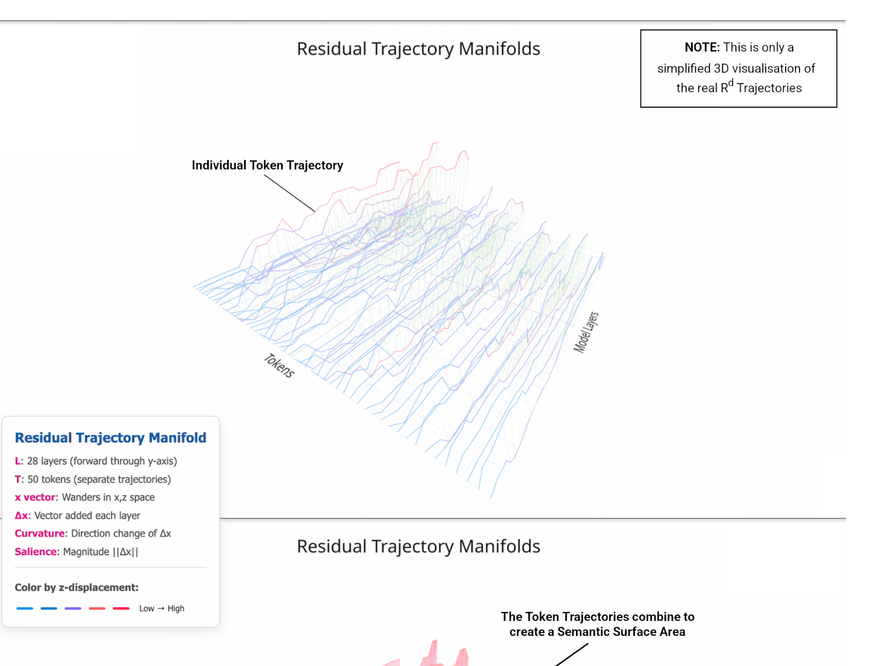
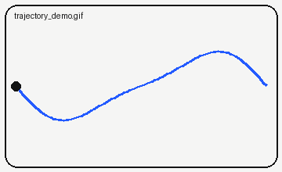

This note is a **draft** (`draft: true`), so it only appears while running `npm run dev`.
Copy anything you need from its source file.

## Text

Plain paragraphs, *emphasis*, **strong**, `inline code`, [links](https://arxiv.org/abs/1706.03762),
footnotes[^1], and ~~strikethrough~~.

> A quotation, set apart from the text.

- a list item
- another, with a nested list
  - like this

| Layer | Probe accuracy | Note |
| ----: | -------------: | :--- |
| 4 | 0.61 | early |
| 16 | 0.88 | middle |

[^1]: Footnotes collect at the end of the note.

## Math

Inline $h_\ell = h_{\ell-1} + f_\ell(h_{\ell-1})$ and display:

$$
\kappa(t) = \frac{\lVert \dot{\gamma}(t) \times \ddot{\gamma}(t) \rVert}{\lVert \dot{\gamma}(t) \rVert^{3}}
$$

## Code

```python
def curvature(h):
    v = h[1:] - h[:-1]          # velocity between layers
    return (v[1:] - v[:-1]).norm(dim=-1)
```

## Pictures

A picture next to the note, with a caption in quotes:



## GIF



## Video


